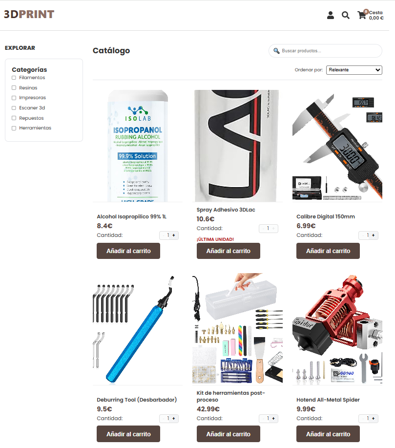
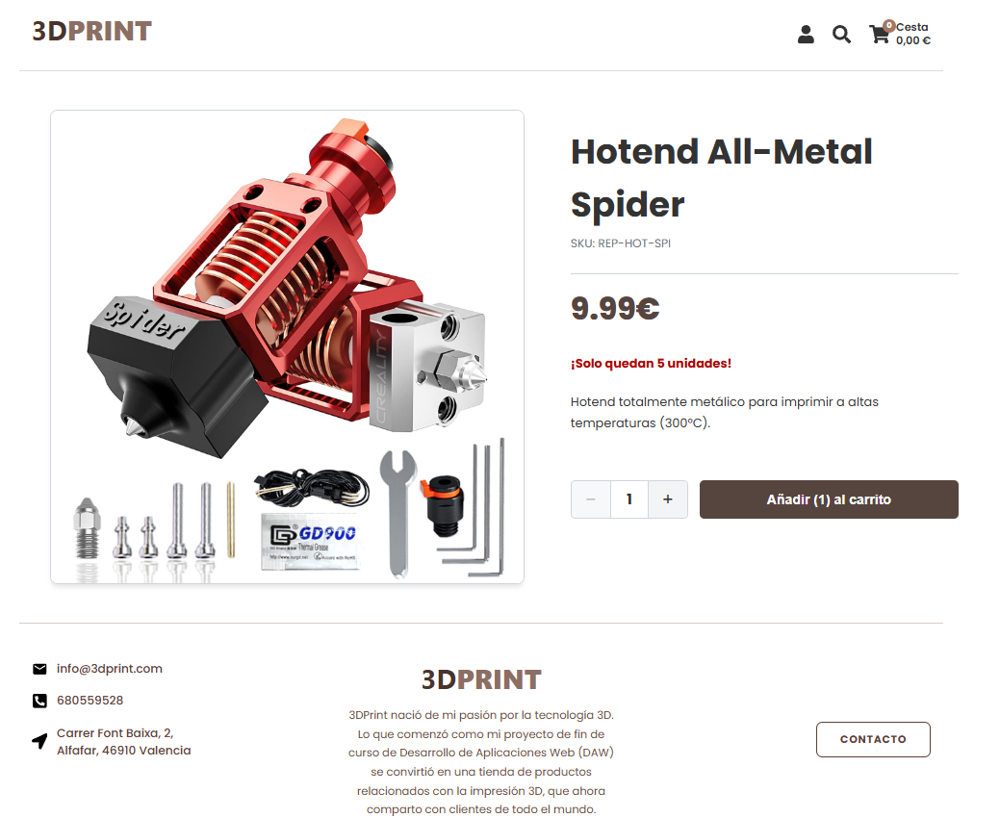
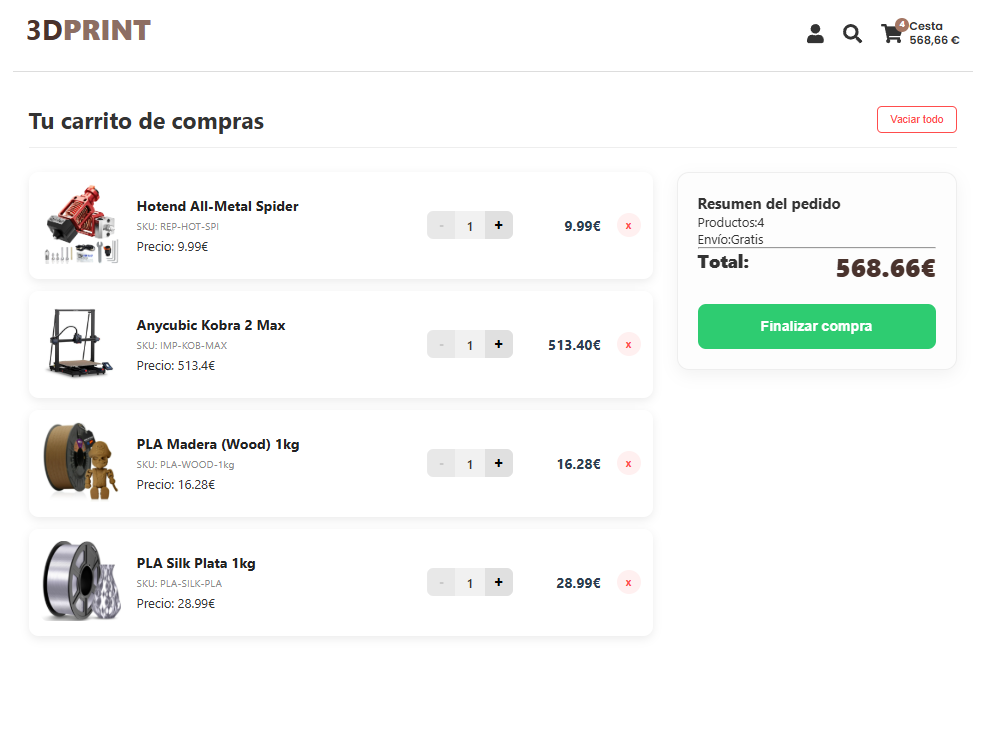
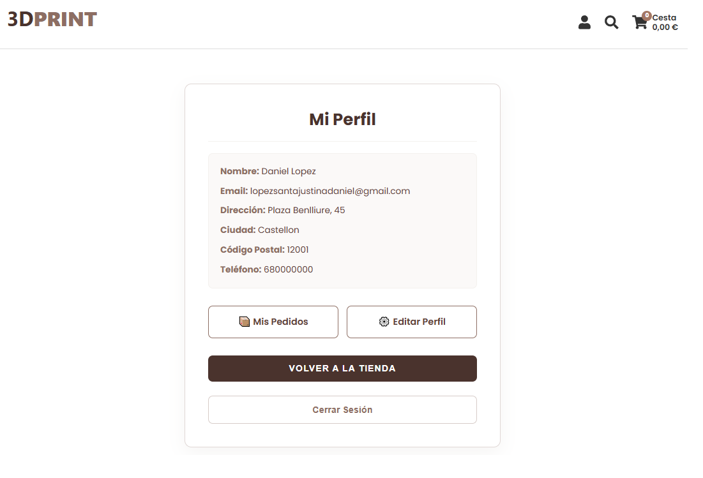
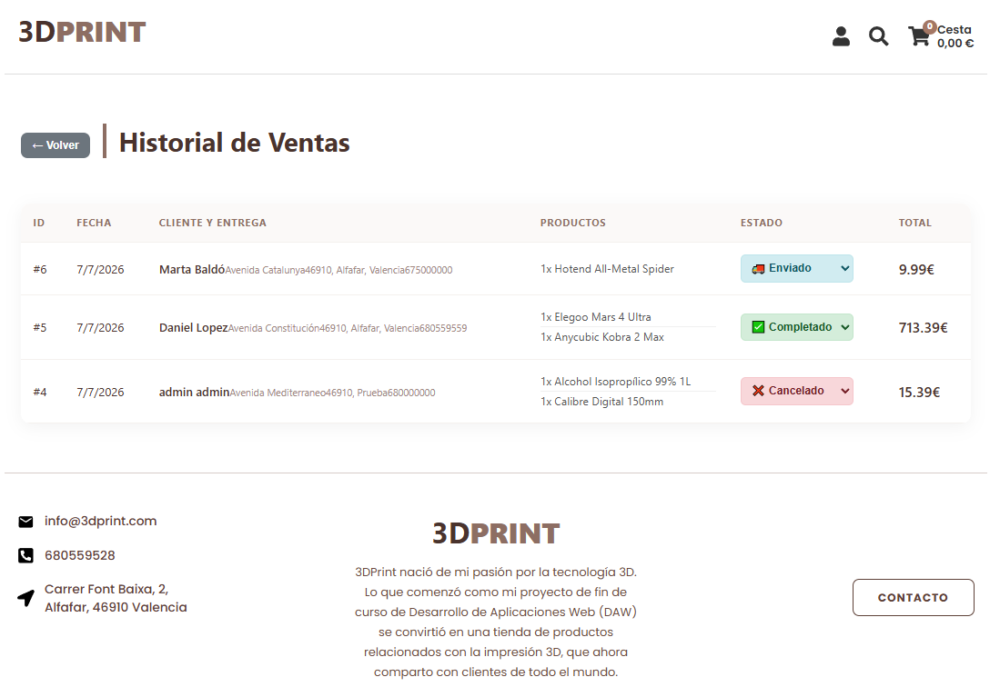
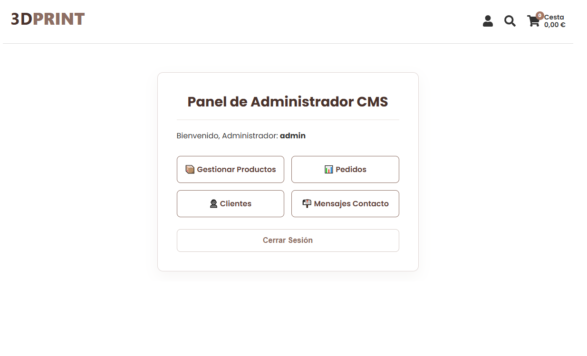
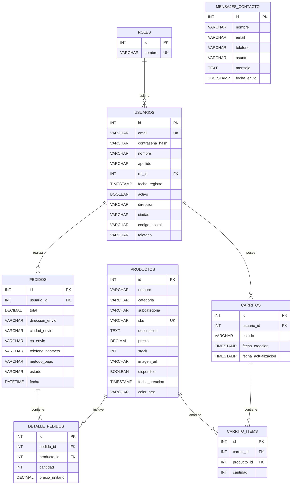

# 🖨️ 3DPrint Ecommerce

## 📌 Proyecto Final DAW - Aplicación Web Full Stack

Aplicación ecommerce desarrollada como proyecto final del **Ciclo Formativo de Grado Superior en Desarrollo de Aplicaciones Web (DAW)**.

El proyecto consiste en una plataforma completa de comercio electrónico orientada a la venta de productos relacionados con la impresión 3D.

La aplicación permite gestionar todo el flujo de compra:

- Visualización del catálogo.
- Búsqueda y filtrado de productos.
- Gestión del carrito.
- Registro y autenticación de usuarios.
- Realización de pedidos.
- Gestión del perfil personal.
- Panel administrativo para gestión de la tienda.

---

# 🌐 Demo Online

La aplicación se encuentra desplegada y disponible para pruebas:

## 🚀 Aplicación funcional

https://3dprintbackend.infinityfreeapp.com/

---

# 📖 Descripción general

3DPrint Ecommerce es una aplicación web Full Stack diseñada para simular un entorno real de comercio electrónico.

El objetivo del proyecto ha sido desarrollar una solución completa utilizando tecnologías actuales de desarrollo web, aplicando separación de responsabilidades entre frontend, backend y base de datos.

La aplicación implementa una arquitectura cliente-servidor donde React actúa como capa de presentación, PHP como API REST y MySQL como sistema de persistencia.

---

# 🏗️ Arquitectura del proyecto

             Usuario

                |
                |
                v

    +----------------------+
    |     React SPA        |
    |     Vite + React     |
    +----------------------+

                |
                |
          Fetch API / JSON

                |
                v

    +----------------------+
    |      PHP API REST    |
    +----------------------+

                |
                |
                v

    +----------------------+
    |       MySQL          |
    +----------------------+

---

# 🚀 Despliegue

Durante la fase inicial de desarrollo se realizó una separación entre frontend y backend:

Frontend
React + Vite
|
|
Backend
PHP + MySQL

El frontend fue preparado para desplegarse de forma independiente.

Sin embargo, debido a problemas derivados de la comunicación entre diferentes dominios y configuración CORS, se decidió realizar un despliegue integrado.

Actualmente la aplicación funciona bajo un único entorno:

InfinityFree

├── React compilado
│
├── API REST PHP
│
└── Base de datos MySQL

Esta decisión permitió:

- eliminar problemas CORS;
- simplificar el despliegue;
- facilitar la evaluación del proyecto;
- disponer de una única URL funcional.

---

# 🛠️ Tecnologías utilizadas

## Frontend

- React 19
- Vite
- JavaScript ES6+
- React Router DOM
- Context API
- Bootstrap 5
- React Bootstrap
- React Icons
- CSS modular

## Backend

- PHP
- API REST
- MySQLi
- JSON
- Gestión de peticiones HTTP
- Control CORS

## Base de datos

- MySQL
- phpMyAdmin
- Modelo relacional

## Herramientas utilizadas

- Visual Studio Code
- Git
- GitHub
- XAMPP
- InfinityFree

---

# ✨ Funcionalidades

# 🛒 Catálogo de productos

El catálogo permite consultar todos los productos disponibles.

Características:

✅ Listado dinámico desde base de datos.

✅ Paginación.

✅ Búsqueda por nombre.

✅ Búsqueda por SKU.

✅ Filtrado por categorías.

✅ Ordenación por precio.

Categorías:

- Filamentos.
- Resinas.
- Impresoras 3D.
- Escáner 3D.
- Repuestos.
- Herramientas.

---

# 🔎 Sistema de búsqueda y filtros

El catálogo sincroniza los filtros con la URL utilizando React Router.

Ejemplo:

/?page=2&categorias=Filamentos&orden=precio_asc

Esto permite:

- mantener el estado al navegar;
- utilizar el historial del navegador;
- compartir búsquedas concretas.

---

# 🛍️ Carrito de compra

El carrito está implementado mediante React Context API.

Funciones disponibles:

- Añadir productos.
- Eliminar productos.
- Modificar cantidades.
- Calcular importe total.
- Validar stock.
- Persistencia local.

Los datos se mantienen mediante:

LocalStorage

---

# 🔄 Migración carrito invitado → usuario

Una de las funcionalidades destacadas es la gestión del carrito cuando un usuario inicia sesión.

Flujo:

Usuario sin cuenta

    |
    |

Añade productos

    |
    |

Login

    |
    |

Se fusiona carrito temporal

    |
    |

Carrito asociado al usuario

Esto evita perder productos durante el proceso de compra.

---

# 👤 Gestión de usuarios

## Registro

Los usuarios pueden crear una cuenta mediante:

- Nombre.
- Apellidos.
- Email.
- Contraseña.

Las contraseñas nunca se almacenan en texto plano.

Se utiliza:

password_hash()

para generar hashes seguros.

---

## Login

El sistema permite:

- autenticación mediante email;
- validación de contraseña;
- control del estado de la cuenta;
- recuperación del perfil.

La validación utiliza:

password_verify()

---

# 📦 Sistema de pedidos

El proceso completo de compra incluye:

Carrito

↓

Datos envío

↓

Creación pedido

↓

Detalle productos

↓

Actualización stock

↓

Confirmación

---

# 🔐 Transacciones SQL

La creación de pedidos utiliza transacciones para garantizar la integridad.

Proceso:

BEGIN TRANSACTION

Crear pedido

Insertar detalle

Actualizar stock

Actualizar usuario

COMMIT

Si ocurre cualquier error:

ROLLBACK

evitando pedidos incompletos o inconsistencias.

---

# 👨‍💻 Panel administrador

La aplicación dispone de un back-office.

Incluye:

## Gestión productos

Permite:

- Crear productos.
- Editar productos.
- Eliminar productos.
- Gestionar stock.
- Controlar disponibilidad.

---

## Gestión pedidos

Permite:

- Consultar pedidos.
- Ver detalles.
- Actualizar estados.

---

## Gestión clientes

Permite:

- Consultar usuarios.
- Modificar información.
- Activar/desactivar cuentas.

---

## Gestión mensajes

Permite:

- Consultar mensajes recibidos.
- Eliminar mensajes.

---

---

# 📸 Capturas de la aplicación

## 🏠 Página principal

Vista general de la tienda y acceso al catálogo de productos.

## 🔎 Detalle de producto

Información detallada del producto seleccionado.

## 🛍️ Carrito de compra

Gestión de productos añadidos, cantidades e importe total.

## 👤 Perfil de usuario

Gestión de datos personales e historial de pedidos.

## 📦 Gestión de pedidos

Consulta del estado de pedidos realizados.

## 🔐 Panel administrador

Administración de productos, usuarios y pedidos.

---

# 🗄️ Modelo de base de datos

La aplicación utiliza un modelo relacional compuesto por 8 tablas:

- usuarios
- roles
- productos
- pedidos
- detalle_pedidos
- carritos
- carrito_items
- mensajes_contacto

# 📂 Estructura del proyecto

## Frontend

src

├── Components

│
├── Admin

│
├── Carrito

│
├── CarritoContext

│
├── Contacto

│
├── DetailsProduct

│
├── Home

│
├── LoginForm

│
├── MiCuenta

│
├── Navbar

│
├── ProductCard

│
└── ProductList

---

## Backend

server

├── conexion.php

├── cors.php

├── login.php

├── registro.php

├── get_product.php

├── crear_pedido.php

├── update_product.php

├── delete_product.php

├── get_pedidos.php

└── ...

---

# 🔌 API REST

Principales endpoints:

| Método | Endpoint | Función |
|-|-|-|
| GET | get_product.php | Obtener catálogo |
| POST | login.php | Login usuario |
| POST | registro.php | Registro |
| POST | crear_pedido.php | Crear pedido |
| GET | get_pedidos_usuario.php | Pedidos usuario |
| PUT | update_product.php | Actualizar producto |
| DELETE | delete_product.php | Eliminar producto |

---

# ⚙️ Instalación local

## Requisitos

Necesario:

- Node.js
- Apache
- PHP
- MySQL

---

# Frontend

Clonar repositorio:

git clone https://github.com/Deve-Lopez/ecommerce-3dprint-frontend.git

Entrar:

cd ecommerce-3dprint-frontend

Instalar dependencias:

npm install

Ejecutar:

npm run dev

---

# Backend

Clonar:

git clone https://github.com/Deve-Lopez/ecommerce-3dprint-backend.git

Configurar:

server/config.php

Crear base de datos e importar estructura SQL.

---

# 📚 Aprendizajes adquiridos

Durante el desarrollo del proyecto se han aplicado conceptos:

## Frontend

- Desarrollo SPA.
- Componentización.
- Gestión de estados.
- Routing.
- Comunicación con APIs.

## Backend

- Creación de APIs REST.
- Gestión de peticiones HTTP.
- Validación de datos.
- Seguridad de contraseñas.

## Base de datos

- Diseño relacional.
- Consultas SQL.
- Relaciones entre tablas.
- Transacciones.

## Despliegue

- Configuración de hosting.
- Integración frontend/backend.
- Resolución de problemas CORS.

---

# 👨‍💻 Autor

**Daniel López Santajustina**

Proyecto realizado como Trabajo Final del:

**Ciclo Formativo de Grado Superior en Desarrollo de Aplicaciones Web (DAW)**

GitHub:

https://github.com/Deve-Lopez